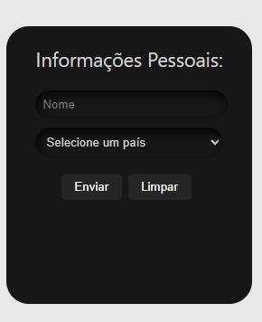

# Formulario Reativo Reacjs x PHP

Aplicação Web em ReactJs desenvolvido com objetivo de aplicar conhecimentos relacionados a requisições HTTP, gestão de promessas em JSX e carregamento dinâmico de dados condicionados.
Nesse projeto foi realizado um formulário simples e sem resposta, onde é possível a inserção de um Nome, um País,um Estado e uma Cidade, sendo que, este aparece apenas se algum estado for selecionado, enquanto aquele só aparece caso haja um país selecionado.
Para a realização desse projeto foi necessário a criação de um servidor local próprio em PHP que, a partir de uma requisição do tipo GET na url (http://localhost:80/webserver/estados.php) é retornado em formato JSON todos os estados do país selecionado, enquanto também é possível realizar requisições a mesma url passando o nome de um Estado existente no país selecionado o que faz com que então seja retornado todas as cidades desse estado também no formato JSON.

## Screenshot da interface sem preenchimento 
A  interface se apresenta da seguinte maneira quando é carregada

## Screenshot da interface preenchida
Ao selecionar Brasil no select de paises e qualquer Estado e Cidade nos seus respectivos select

>[!NOTE]
Enfoca-se as funções JSX presentes no arquivo Formulario.jsx, que serve como componente central e essencial no funcionamento e dinamicidade da aplicação.
>
>[Analise o código clicando aqui](formulario-app/src/componentes/Formulario/Formulario.jsx)

>[!NOTE]
Para o funcionamento integral da aplicação é necessário iniciar um servidor apache local contendo os arquivos do webserver presentes neste repositório, sendo assim as requisições HTTP serão realizadas com sucesso.
